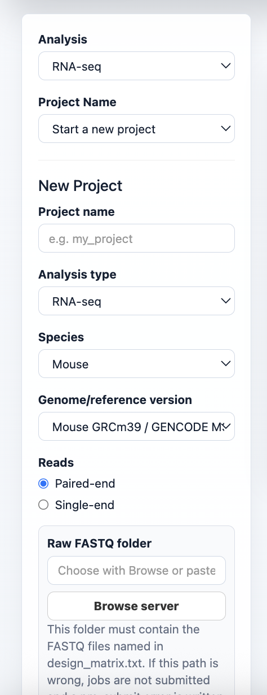

# CodeSpringApp

CodeSpringApp is a Shiny-based control center for running, monitoring, and reviewing CodeSpringLab sequencing projects from one server port. It replaces notebook prompts with a clean, button-driven interface for project setup, design-matrix editing, SLURM submission, progress tracking, logs, methods, and the native CodeSpringLab RNA-seq Results Explorer.

It is designed for shared HPC environments where analyses should continue running after the browser or app is closed.


## Run On The Server

Use the launcher script. It checks required packages, clears stale listeners on the chosen port, starts Shiny, and prints the exact SSH tunnel command to run from your laptop.

Each person should use their own port. If two people try to use `8601` on the same server at the same time, only one app can bind to that port. Pick another open port such as `8602`, `8603`, or `8610`.

On the server:

```bash
cd ~/CodeSpringApp
./run_codespringweb.sh 8601
```

From your laptop:

```bash
ssh -N -L 8601:localhost:8601 $USER@bamdev1
```

Then open:

```text
http://localhost:8601
```

If your server folder is still named `CodeSpringWeb`, either rename it or run from that folder:

```bash
mv ~/CodeSpringWeb ~/CodeSpringApp
cd ~/CodeSpringApp
./run_codespringweb.sh 8601
```

## What It Does

- Creates or resumes CodeSpringLab projects from saved project configs.
- Builds and edits design matrices from FASTQ folders.
- Submits real SLURM `sbatch` jobs for cutadapt, FastQC, STAR, featureCounts, DESeq2, GSEA, RSEM, and Kallisto.
- Tracks per-sample and per-comparison progress with completed, running, cancelled, deleted, and likely failed states.
- Resubmits only failed, cancelled, missing, or deleted samples while skipping active and completed jobs.
- Embeds the native CodeSpringLab RNA-seq Results Explorer in the same Shiny app.
- Records logs, methods, tool versions, reference genome selections, and run parameters.

## Preview

### Project Setup

Create new projects, select species/reference builds, browse server folders, and manage project configs/results.

| Project selection | Server folder browser |
| --- | --- |
|  |  |

### Design Matrix

Scan FASTQ folders, include/exclude samples, rename samples, and edit metadata columns directly in the app.


### Run Pipeline

Each step has its own parameters, submit button, status panel, sample progress, cancel controls, and data-delete controls.


### Progress

See workflow-level status and sample-by-step status in a compact matrix.


### Results Explorer

Review QC, count matrices, DESeq2 results, PCA, volcano plots, heatmaps, and GSEA outputs without opening another port.


### Logs And Methods

Browse project logs by tool, sample/run, and output/error type. Export project/reference and tools/reference methods tables.


## Project Discovery

CodeSpringApp discovers existing CodeSpringLab project configs from:

```text
<CodeSpringLab>/scripts_DoNotTouch/project_configs/<analysis>/*.py
<CodeSpringLab>/project_configs/<analysis>/*.py
```

For new projects, it creates project-local outputs under:

```text
<results_root>/<project_name>/
  data/
  log/
  shiny/
```

## Tabs

- `Setup`: choose analysis/project, create projects, browse server folders, select genome references, and delete configs/results.
- `Design Matrix`: scan FASTQ folders, include/exclude samples, edit metadata, and save a project-local `design_matrix.txt`.
- `Run Pipeline`: submit SLURM jobs with step-specific settings and safeguards.
- `Progress`: monitor step and sample progress, including active, cancelled, deleted, and likely failed states.
- `Results Explorer`: load CodeSpringLab's native RNA-seq Shiny viewer inside CodeSpringApp.
- `Logs`: inspect tool logs and submit logs.
- `Methods`: summarize project metadata, tools, versions, references, and parameters.

## Job Submission

Run buttons submit jobs through `sbatch`, so jobs are owned by SLURM after submission. Closing the browser or stopping Shiny does not cancel jobs already accepted by SLURM.

CodeSpringApp records submitted job metadata under:

```text
~/.codespringweb/
```

Project logs are written under:

```text
<results_root>/<project_name>/log/
```

