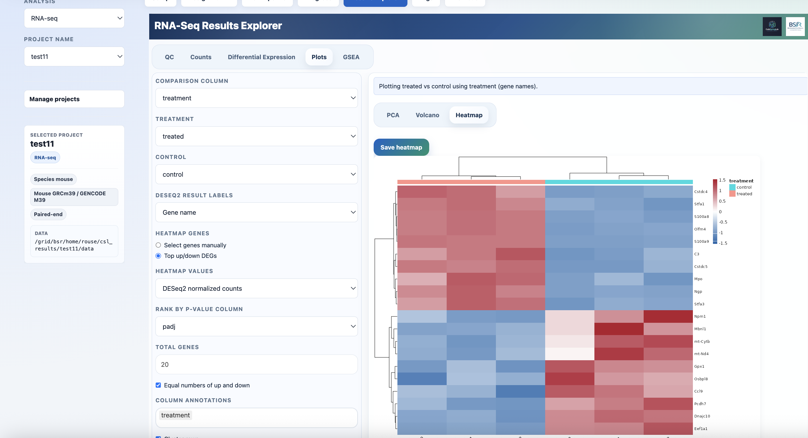
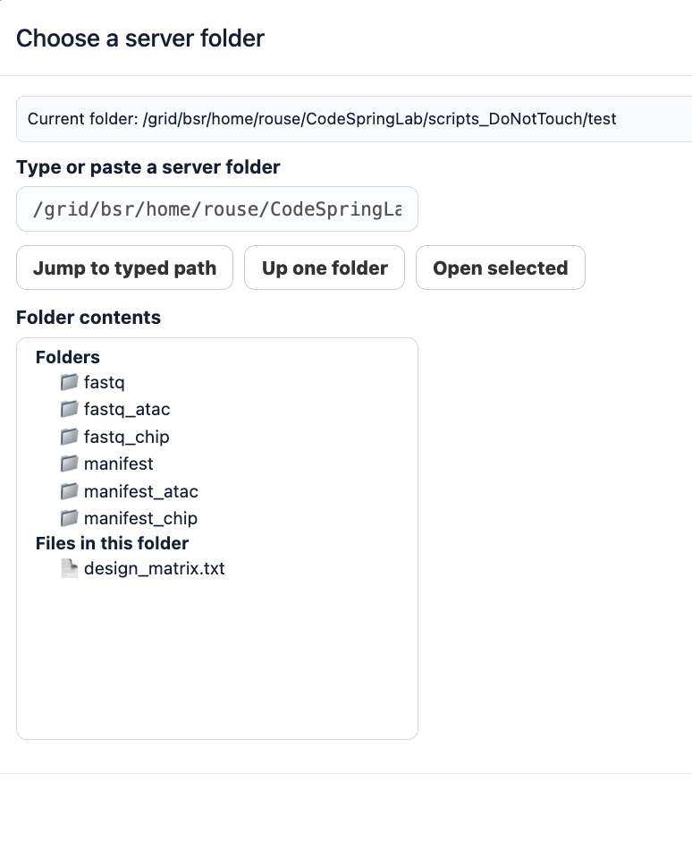
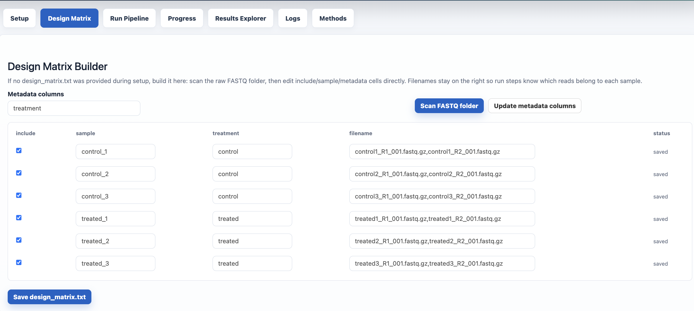
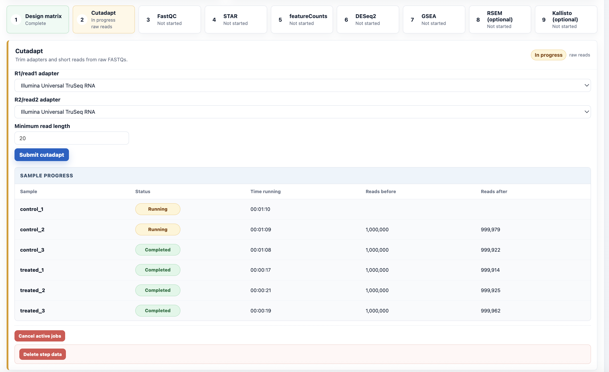
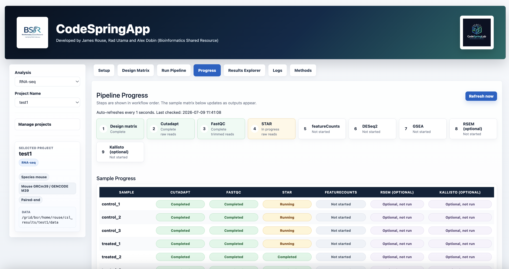
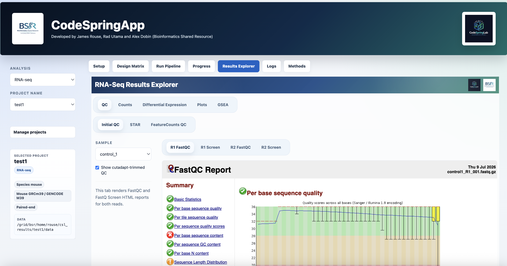
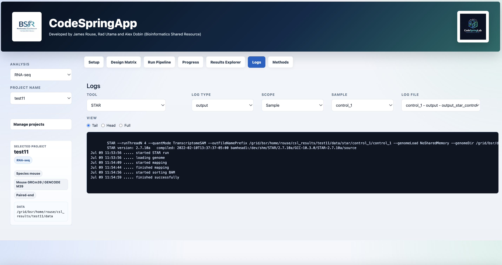

# CodeSpringApp

CodeSpringApp is a Shiny-based control center for running, monitoring, and reviewing CodeSpringLab sequencing projects from one server port. It replaces notebook prompts with a clean, button-driven interface for project setup, design-matrix editing, SLURM submission, progress tracking, logs, methods, and the native CodeSpringLab RNA-seq Results Explorer.

It is designed for shared HPC environments where analyses should continue running after the browser or app is closed.



## What It Does

- Creates or resumes CodeSpringLab projects from saved project configs.
- Builds and edits design matrices from FASTQ folders.
- Submits real SLURM `sbatch` jobs for cutadapt, FastQC, STAR, featureCounts, DESeq2, GSEA, RSEM, and Kallisto.
- Tracks per-sample and per-comparison progress with completed, running, cancelled, deleted, and likely failed states.
- Resubmits only failed, cancelled, missing, or deleted samples while skipping active and completed jobs.
- Embeds the native CodeSpringLab RNA-seq Results Explorer in the same Shiny app.
- Records logs, methods, tool versions, reference genome selections, and run parameters.

## Preview

### Project Setup

Create new projects, select species/reference builds, browse server folders, and manage project configs/results.



### Design Matrix

Scan FASTQ folders, include/exclude samples, rename samples, and edit metadata columns directly in the app.



### Run Pipeline

Each step has its own parameters, submit button, status panel, sample progress, cancel controls, and data-delete controls.



### Progress

See workflow-level status and sample-by-step status in a compact matrix.



### Results Explorer

Review QC, count matrices, DESeq2 results, PCA, volcano plots, heatmaps, and GSEA outputs without opening another port.



### Logs And Methods

Browse project logs by tool, sample/run, and output/error type. Export project/reference and tools/reference methods tables.



## Static Demo

GitHub cannot run a live Shiny app in a README, but this repo includes a static visual tour that can be published with GitHub Pages:

```text
docs/index.html
```

After enabling GitHub Pages for the `docs/` folder, the demo will be available at:

```text
https://jamesrouse1.github.io/CodeSpringApp/
```

The static demo is intentionally visual only. The real app still runs on your server because it depends on CodeSpringLab, SLURM, project data, and reference files.

## Run On The Server

Use the launcher script. It installs required R packages into your user library if they are missing, clears stale listeners on the chosen port, starts Shiny in the background, and prints the exact SSH tunnel command for your laptop.

```bash
cd ~/CodeSpringApp
./run_codespringweb.sh 8601
```

From your laptop, run the SSH tunnel printed by the launcher. It will look like this:

```bash
ssh -N -L 8601:localhost:8601 rouse@bamdev1
```

Then open:

```text
http://localhost:8601
```

If your server folder is still named `CodeSpringWeb`, either rename it or run from that folder:

```bash
mv ~/CodeSpringWeb ~/CodeSpringApp
cd ~/CodeSpringApp
./run_codespringweb.sh 8601
```

## Project Discovery

CodeSpringApp discovers existing CodeSpringLab project configs from:

```text
<CodeSpringLab>/scripts_DoNotTouch/project_configs/<analysis>/*.py
<CodeSpringLab>/project_configs/<analysis>/*.py
```

For new projects, it creates project-local outputs under:

```text
<results_root>/<project_name>/
  data/
  log/
  shiny/
```

## Tabs

- `Setup`: choose analysis/project, create projects, browse server folders, select genome references, and delete configs/results.
- `Design Matrix`: scan FASTQ folders, include/exclude samples, edit metadata, and save a project-local `design_matrix.txt`.
- `Run Pipeline`: submit SLURM jobs with step-specific settings and safeguards.
- `Progress`: monitor step and sample progress, including active, cancelled, deleted, and likely failed states.
- `Results Explorer`: load CodeSpringLab's native RNA-seq Shiny viewer inside CodeSpringApp.
- `Logs`: inspect tool logs and submit logs.
- `Methods`: summarize project metadata, tools, versions, references, and parameters.

## Requirements

Required R packages:

```r
install.packages(c("shiny", "DT", "base64enc", "ggplot2"))
```

The launcher handles these automatically:

- `DT`: editable, searchable, scrollable tables
- `base64enc`: embedded logos/images
- `ggplot2`: publication-style plot support

GSEA runs through the CodeSpringLab Python/GSEApy implementation. On `bamdev1`, the submitted GSEA job loads:

```bash
module load BSR
module load Python/3.7.4-GCCcore-8.3.0
```

## Job Submission

Run buttons submit jobs through `sbatch`, so jobs are owned by SLURM after submission. Closing the browser or stopping Shiny does not cancel jobs already accepted by SLURM.

CodeSpringApp records submitted job metadata under:

```text
~/.codespringweb/
```

Project logs are written under:

```text
<results_root>/<project_name>/log/
```

## GSEA

GSEA jobs are submitted as Python jobs using CodeSpringLab's existing `bulkRNAseq.gseapy_RunPathway()` function.

The app uses:

- DESeq2 normalized counts from `<project>/data/deseq2`
- The selected design-matrix comparison column
- Signal-to-noise ranking
- Gene-set permutations
- Seed `8`
- Enrichr/GMT-style gene-set databases
- The bundled local mouse-human ortholog table for mouse projects

Outputs are written under database-specific folders:

```text
<project>/data/gseapy/<comparison>_vs_<reference>/<gene_set_database>/
```

## Troubleshooting

Check the newest GSEA logs for the selected project:

```bash
cd ~/csl_results/<project_name>/log
ls -lhtr *gseapy*.txt
tail -120 "$(ls -t submit_gseapy_*.txt | head -1)"
tail -120 "$(ls -t error_gseapy_*.txt | head -1)"
tail -120 "$(ls -t output_gseapy_*.txt | head -1)"
```

Check why a SLURM job was cancelled:

```bash
sacct -j JOBID --format=JobID,JobName,State,ExitCode,Elapsed,Start,End,Reason%50
scontrol show job JOBID
```

## Useful Environment Variables

- `CSL_CODESPRINGLAB_ROOT`: path to the CodeSpringLab repo. Default: `~/CodeSpringLab`
- `CSL_WEB_HOST`: Shiny host binding. Default: `0.0.0.0`
- `CSL_WEB_LOG_DIR`: launcher log/pid folder. Default: `~/.codespringweb`
- `CSL_WEB_AUTOKILL_SHINY`: set to `0` to disable startup cleanup of stale Shiny sessions.
- `CSL_PYTHON_BIN` or `PYTHON_BIN`: optional Python executable override for GSEApy jobs.

